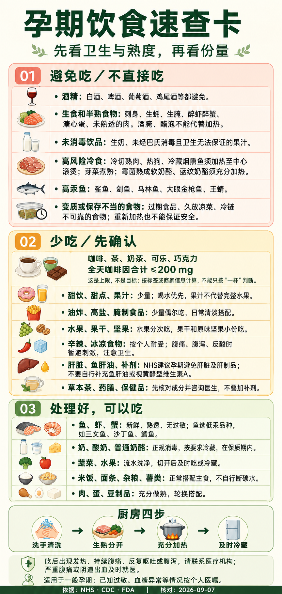

# 孕期饮食速查卡

用于一般孕期的家庭点餐、采购和做饭时快速核对，可将长图保存到手机相册。个人过敏、血糖异常或其他疾病相关饮食方案以医生建议为准。

## 手机长图

[打开原图并保存](./images/孕期饮食速查卡.png)

## 使用要点

- **避免吃／不直接吃**：区分酒精、高汞鱼等应避免的食物，与需要充分加热后再吃的肉蛋海鲜、冷切熟肉、热狗等。
- **少吃／先确认**：咖啡因按全天所有来源合计，控制在 **200 mg 以内**；这不是建议摄入目标，不能简单按“一杯”估算。甜饮、油炸和高盐食品少量偶尔吃。
- **处理好，可以吃**：熟透的低汞鱼虾蟹、正规消毒奶制品、洗净蔬果、主食和熟透的肉蛋豆制品可以轮换搭配。“可以吃”不代表不限量。
- 肝脏及肝制品的避免建议采用 NHS 口径；不将其写成中国统一禁食规定。补铁或其他营养补充方案咨询产科医生，不自行叠加鱼肝油、视黄醇型维生素 A 或其他补剂。
- 辛辣、冰凉食物按个人耐受调整；图中“暂避刺激”不表示所有孕妇都必须禁食冰凉食物。
- 图中鱼类是举例，不是完整名单。大眼金枪鱼与其他金枪鱼、王鲭与其他鲭鱼不能混同，购买时确认品种。

进一步安排饮食见[孕早期饮食注意事项](./孕早期饮食注意事项.md)；日常记录见[孕期日常管理](./孕期日常管理.md)。

## 内容依据与复核

- 采用来源：NHS-FOODSAFE-001、NHS-SUPP-001、FDA-FISH-001、CDC-FOODSAFE-001、NHS-DIET-001、NHS-RISK-001；详见[项目参考资料](../../references/README.md)。
- 最近复核：2026-09-07
- 图片由 AI 辅助排版，内容已对照来源核对；后续医学内容变化时同步更新长图和本页，勿仅修改页面日期。
- 国际机构资料用于通用参考，不能替代个人医嘱；严重腹痛、阴道出血等异常及时就医。
